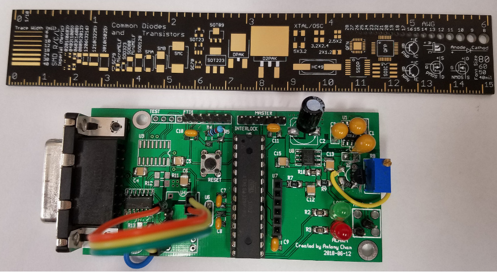
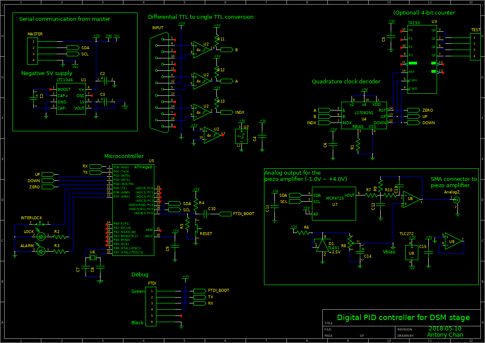
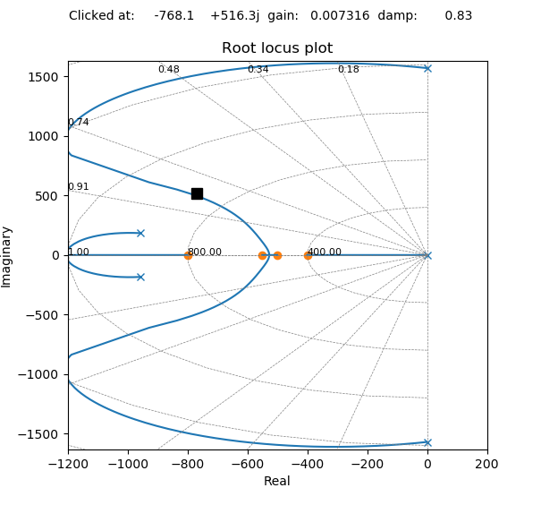
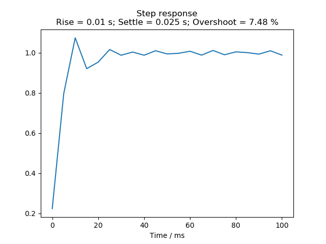
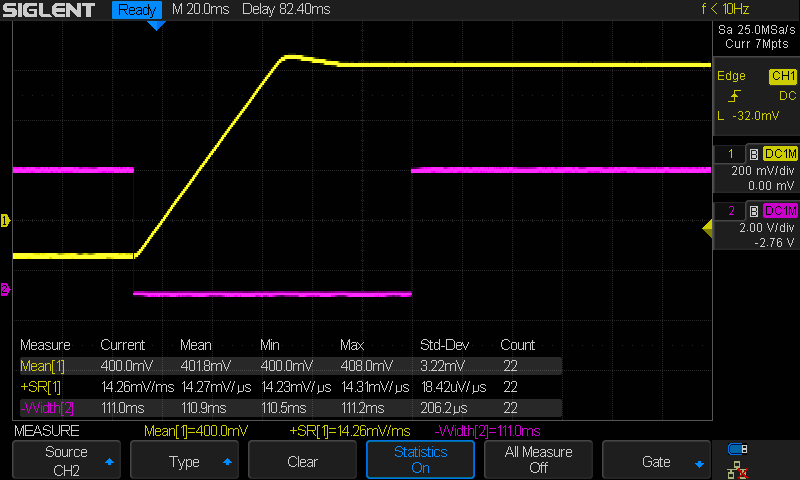
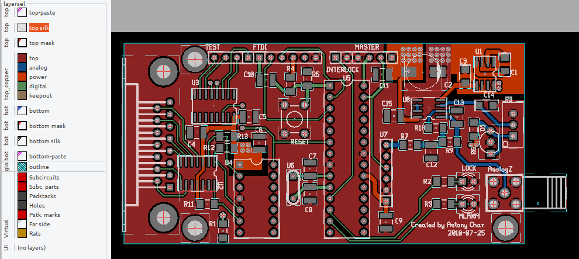

# Piezo-flexure nano-positioning stage PID controller

The PCB to implement z-stack focus scanning with a custom piezo-flexure nano-positioning stage.

Technical specifications:

* Power input: 5VDC, max 200mA.

* Output: analog output for the piezo class-A amplifier,
  bandwidth 250kHz max, dual rail +/- 5V via the 50 Ohm coaxial cable.

* Position sensor: linear encoder with differential quadrature TTL output.

* MCU programming interface: UART over TTL, via a 6-pin connecter with the [FTDI
  friend USB adapter](https://www.adafruit.com/product/284).

* External position control: I2C bus to reduce the cabling effort.

## Why I made my own board

The board is primarily used to actuate the Piezo-flexure nano-positioning Z-axis stage
at a step size of 5 micrometer; full travel range of 0~250
micrometer, and a close-loop settle time of 50 millisecond. The 50 millisecond
settle time requirement originates from the need to avoid motion blur in the
96-camera imaging light path; the stage must settle completely before the
flurorescence-excitation flash light can be turned on.

## Preview

## Schematic

## Design intent

**DAC signal conditioning filter, with analog level shifting.** A majority of
the R&D effort was spent on the DAC signal conditioning OpAmp filter design, as
shown in the schmatic drawing. The single-rail DAC
[MCP4725](https://www.adafruit.com/product/935) is capable of a fast output with
a high dynamic range; essential for a high open-loop gain for responsive Z-stack
scanning. However, the DAC outputs a zero-order hold (ZOH) signal which can cause the damaging
oscillation of the 40X piezo class-A amplifier and humming of the stage. So, it
justifies interfacing the DAC and the power amplifier with a signal conditioning
filter to smooth out the signal, having the following properties:

* a sufficient phase margin at the stage natural frequency of 250Hz;
* a full voltage swing between -1.0V and +4.0V;
* a high OpAmp input impedance to adjust the analog level shift, up to the Tera-Ohm scale;
* a reasonable pink noise to avoid drifting of the analog output.

I ended up implementing a multiple feedback, 2nd order low pass filter with a
unity gain. A CMOS-FET based OpAmp (TLC227x) is favored over JFET for its
negligable input bias current (down to nA). I also abused such a feature to
adjust the input bias on the non-inverting input with a precision voltage source
(TL431). Otherwise, I would have to add numerous voltage follower
sub-circuits with more OpAmp ICs, which can introduce more failure modes.

**Close-loop position feedback control mechanism** The piezo-flexure mechanism
is known to resemble a spring-mass 2nd order system having an extremely small
damping ratio (<= 0.0.1). So, the controller should actively attenuate the 250Hz
oscillation in the z-axis stage. The need of the post-DAC signal conditioning
filter also introduces instability at around the Nyquist bandwidth at around
100Hz, so a sufficient phase margin should be increased as well.

I ended up using a controller having 2 zeros and 3 poles in the continuous
transfer function. As shown in the root locus plot of the s-plane below, the
zero at $s=-800$ dampens the 100Hz poles of the OpAmp low pass filter. The two
poles at $s=-400$ and $s=-500$ pulls the root loci of the 250Hz poles to the
left half plane, attenuating the stage oscillation. 

The same pole pair also moves the dominating close-loop poles to $j\omega <=
500$ and damping ratio $\xi \leq 0.6$, so that the rise time can fall between
5ms and 15ms. The remaining zero and pole near the origin ensures the stage
settle time is within 50ms.

In practice, the controller transfer function is mapped to the z-plane with
bilinear transform. The z-terms are rearranged to resemble a PID contoller
followed by a 1st order IIR filter. A PID controller code is used over the
direct form in the MCU code because this is how most of the embedded engineers
program the control systems. The theoretical transfer function of the controller is:

$$
\frac{U(z)}{E(z)} = 
G \times
\frac{z^{-1} + 1.0 z^{-1} + 1.7 z^{-2} + 1.7 z^{-3}}
{1 - 0.889 z^{-1} - 0.111 z^{-2} - 2.4\times 10^{-17} z^{-3}}.
$$

Where G is the proportional gain suggested by the root locus plot.
After tuning the coefficients on the physical
system, the transfer function becomes:

$$
\frac{U(z)}{E(z)} = 
G \times
\frac{z^{-1} + 10 z^{-2} - 20 z^{-3}}{1 - z^{-1}}
$$

**Differential TTL to single TTL conversion.** The linear encoder measures the
relative position of the Z-stage. It outputs the quadrature signal in
differential TTL format, compatible to the RS485 protocol. The MCU can decode the
linear encoder step count with the external edge interrupt, but only in single
TTL. So, I implemented the differential TTL to single TTL conversion with a
simple digital comparator circuit.

If I were to design the circuit again, I would have implemented a 3 channel
Schmitt trigger circuit having an artifical input hysteresis. Or, sourced for a
3 channel ASIC.

**Quadrature to z-position conversion.** As shown in the schematic drawing, I
originally favored the clock decoder ASIC
[LS7802N](https://www.anaheimautomation.com/manuals/ics/L010543%20-%20LSI-LS7082N.pdf)
to offload the edge interrupt and pulse counting logic. The clock decoder IC is
capable of converting the quadrature signal to UP/DOWN step count, as well as
Index zero pulse. Since the UP/DOWN pulse rate is at 25% of the quadrature pulse
rate, theoretically it should reduce the chance of missed count in the MCU..

However, due to the logistic challenge at the time, I ditched the clock decoder
idea, and directly implemented the conversion logic in the MCU firmware. I used
the decoder library written by [Paul
Stoffregen](https://github.com/PaulStoffregen/Encoder).

The decoded UP/DOWN step count is then accumulated on demand to return the
Z-position in micrometer. To further stabilize the PID position control, I added
a first-order IIR filter as the software signal pre-conditioning filter. The IIR
filter effectively adds an additional pole in the open loop response to increase
the phase margin at 250Hz.

**Software slew rate limiter of input position signal** Whenever the user
requests a large Z-axis displacment, the PID loop suffers from integral windup.
Integral windup happens when the desired Z-position is set above or below 50
micrometer of the current position. I mitigated the issue with a slew-rate
limiter between the desired position input and the PID input, effectively
converting a step motion request to a ramp motion request with a max Z-velocity
of 10 mm/s.

## PCB

The MCU footprint should have been a QFP package. At the time, the DIP package
was favored because of the need to flash the bootloader ahead of MCU mounting.
Nowadays, the Atmel328p QFP package often comes with a preloaded bootloader,
so it should simplify the PCB design a lot.

## Literatures

* More filter design on a budget. Texas Instruments. https://www.ti.com/lit/pdf/sloa096
* Firmware implementation of the quadrature clock decoder logic. Paul Stoffregen. https://www.pjrc.com/teensy/td_libs_Encoder.html

 This work
is licensed under a <a rel="license"
href="http://creativecommons.org/licenses/by-sa/4.0/">Creative Commons
Attribution-ShareAlike 4.0 International License</a>.
